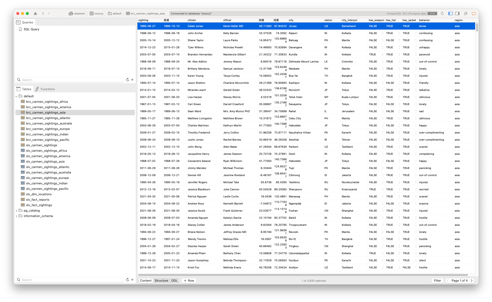
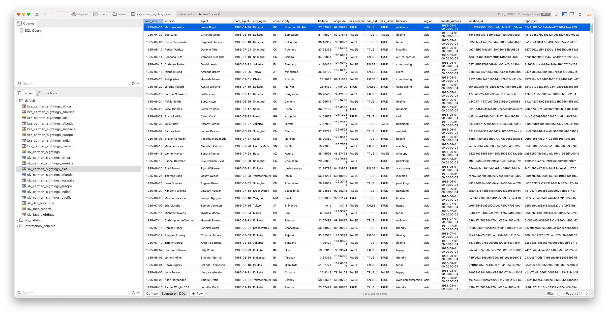
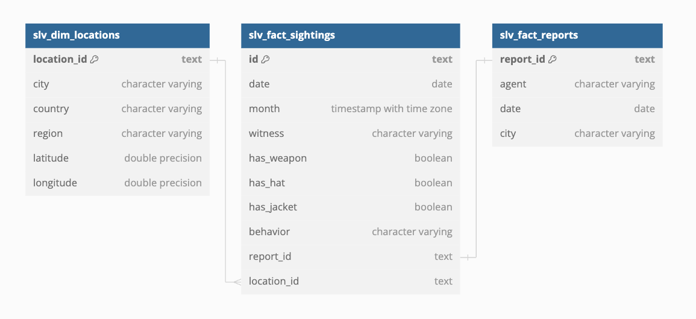

# Cascade Data Engineering Assessment

## Background 
The objective of this assessment is to showcase our ability to:
- Design and build a basic ELT pipeline, moving and processing raw data into aggregated, 
  analytics-ready datasets.
- Showcase our ability to use modern tooling to efficiently generate the desired results
- Have fun!

## Problem Definition
We are presented with an Excel spreadsheet storing sightings of Carmen Sandiego
and are asked to answer a few questions with respect to this dataset. 


## Proposed Solution
In this version of the assignment, the solution leverages a dbt project linked
to a local instance of PostgreSQL database. It organizes the tables and views 
following medallion architecture.

An alternative, spark-based approach leveraing Databricks DLT and Laktory was
also provided [here](https://github.com/osoucy/cascade-carmen-spark).

## Medallion
The problem to be solved is an excellent candidate for a medallion 
architecture, consisting of 3 layers:

* Bronze tables: raw and unaltered data 
* Silver tables: filtered, cleaned and modeled data
* Gold tables: aggregated data, ready for analytics consumption and specific use cases

### Bronze Tables
The bronze tables are an exact representation of the data found in the Excel
spreadsheets. There is one table per region (or per sheet) using the following
naming convention: `brz_carmen_sigthings_{region}`. As an example, here is the
bronze table for asia: 


The column names have not been altered in any way and no transformation have 
been applied. The tables are created from csv using dbt seed function.

The csv files were generated from a python [script](scripts/build_seeds.py)
using pandas reader and writer:
```py
import pandas as pd

REGIONS = ["africa", "america", "asia", "atlantic", "australia", "europe",
    "indian", "pacific"]

for region in REGIONS:

    # Read
    df = pd.read_excel("../data/carmen_sightings_20220629061307.xlsx", sheet_name=region.upper())
    df["region"] = region

    # Write
    df.to_csv(f"../seeds/brz_carmen_sightings_{region}.csv", index=False)
```

### Silver Tables
The next step is to define the silver as a transformation of the bronze tables.
The transformation in this case consisted of :
* Standardize column names
* Selecting column of interest
* Creating normalization ids

A preliminary analysis of the raw data has shown that no duplicates were found
in any of the regions. Here is what it looks like for the Asia region.


We used a dbt [macro](macros/create_silver.sql) to apply the same 
transformation to all regions.
```sql

    select
        {{ renames.date_witness }}::date as date_witness,
        {{ renames.witness }}::varchar as witness,
        {{ renames.agent }}::varchar as agent,
        {{ renames.date_agent }}::date as date_agent,
        {{ renames.city_agent }}::varchar as city_agent,
        {{ renames.country }}::varchar as country,
        {{ renames.city }}::varchar as city,
        {{ renames.latitude }}::float as latitude,
        {{ renames.longitude }}::float as longitude,
        {{ renames.has_weapon }}::boolean as has_weapon,
        {{ renames.has_hat }}::boolean as has_hat,
        {{ renames.has_jacket }}::boolean as has_jacket,
        {{ renames.behavior }}::varchar as behavior,
        region::varchar as region,
        date_trunc('month', {{ renames.date_witness }}::date) as month_witness,
        {{ dbt_utils.generate_surrogate_key([renames.city]) }} as location_id,
        {{ dbt_utils.generate_surrogate_key([renames.agent, renames.date_agent, renames.city_agent]) }} as report_id
    from
        {{ source_table }}

```

The `renames` dictionary is region-specific and maps the region-specific column
names to the standard column names. Columns `location_id` and `report_id` will
be used for normalization of the data model.

Once we have all the region-specific silver tables, we create 
`slv_carmen_sightings` which is a union of all other silver tables.

```sql
WITH
 africa AS (SELECT * FROM {{ ref('slv_carmen_sightings_africa') }}),
 america AS (SELECT * FROM {{ ref('slv_carmen_sightings_america') }}),
 asia AS (SELECT * FROM {{ ref('slv_carmen_sightings_asia') }}),
 atlantic AS (SELECT * FROM {{ ref('slv_carmen_sightings_atlantic') }}),
 australia AS (SELECT * FROM {{ ref('slv_carmen_sightings_australia') }}),
 europe AS (SELECT * FROM {{ ref('slv_carmen_sightings_europe') }}),
 indian AS (SELECT * FROM {{ ref('slv_carmen_sightings_indian') }}),
 pacific AS (SELECT * FROM {{ ref('slv_carmen_sightings_pacific') }})

SELECT
    {{ dbt_utils.generate_surrogate_key(['date_witness', 'location_id', 'report_id']) }} as id,
    *
FROM
    (
        SELECT * FROM africa
        UNION
        SELECT * FROM america
        UNION
        SELECT * FROM asia
        UNION
        SELECT * FROM atlantic
        UNION
        SELECT * FROM australia
        UNION
        SELECT * FROM europe
        UNION
        SELECT * FROM indian
        UNION
        SELECT * FROM pacific
    )
```


#### Normalization

To reduce redundancy and better organize the data for analytics, the wide
table is transformed in 3 tables:
- 1 fact table `slv_fact_sightings` listing all sightings
- 1 fact table `slv_fact_reports` listing all reports (agent, date city)
- 1 dimension `slv_dim_locations` table providing the details of a location (city, country, region, latitude and longitude)

The relationships are summarized in this entity relationships diagram:



### Gold Tables
Finally, 3 gold tables (and a view) were defined to the analytics questions.

##### Behavior Aggregation
The first gold table count the number of occurrence of each behavior. It is
defined as
```yaml
  - name: gld_carmen_sightings_by_behavior
    builder:
      layer: GOLD
      table_source:
        name: slv_carmen_sightings
        read_as_stream: false
      aggregation:
        groupby_columns:
          - behavior
        agg_expressions:
          - name: count
            spark_func_name: count
            spark_func_args:
              - region
```

and results in

